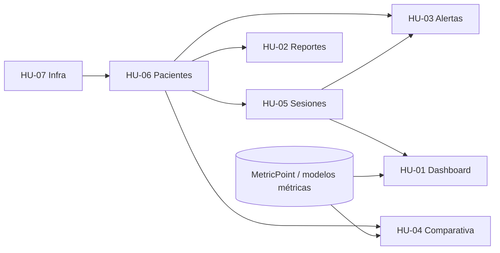

# Planes de acción por historia de usuario (Módulo 5)

Esta carpeta contiene **un plan de acción ejecutable por HU** (HU-01 … HU-07), alineado con:

| Documento | Rol |
|-----------|-----|
| [`../Historias de Usuario Modulo 5.md`](../Historias%20de%20Usuario%20Modulo%205.md) | Criterios de aceptación de producto (AC). |
| [`../Plan-backend-por-historia-equipo.md`](../Plan-backend-por-historia-equipo.md) | Alcance Django/DRF/MySQL, reparto sugerido por integrante. |
| [`../Reporte de trabajo frontend.md`](../Reporte%20de%20trabajo%20frontend.md) | Lo ya construido en Angular (mocks, rutas, servicios). |
| [`../Contrato-API-endpoints-DTO-serializers.md`](../Contrato-API-endpoints-DTO-serializers.md) | Rutas y convenciones JSON/auth compartidas. |

## Índice de planes

| HU | Archivo | Enfoque principal |
|----|---------|-------------------|
| HU-01 | [HU-01-plan-accion.md](./HU-01-plan-accion.md) | Dashboard JSON + rendimiento (menos de 3 s) + datos reales MySQL |
| HU-02 | [HU-02-plan-accion.md](./HU-02-plan-accion.md) | Exportación PDF/XLSX + filtros + autorización terapeuta |
| HU-03 | [HU-03-plan-accion.md](./HU-03-plan-accion.md) | Inactividad (más de 3 días) + cron + API de alertas |
| HU-04 | [HU-04-plan-accion.md](./HU-04-plan-accion.md) | Series meta/real + comparativa multi-paciente + fórmula |
| HU-05 | [HU-05-plan-accion.md](./HU-05-plan-accion.md) | Historial paginado + detalle async por id |
| HU-06 | [HU-06-plan-accion.md](./HU-06-plan-accion.md) | CRUD pacientes, vínculo terapeuta–paciente, soft delete |
| HU-07 | [HU-07-plan-accion.md](./HU-07-plan-accion.md) | Infra API + CORS + errores; cierre con UI ya entregada |

## Grafo de dependencias (orden sugerido de desbloqueo)

- **HU-07** debe avanzar **primero** (rutas `/api/v1/`, auth, paginación, CORS, `health`, semillas).
- **HU-06** provee pacientes y vínculos: casi todas las demás HUs filtran “solo mis pacientes”.
- **HU-05** alimenta última sesión, partes del dashboard y la lógica de inactividad.
- **MetricPoint** (o equivalente) comparte **HU-01** y **HU-04**: conviene diseñar el modelo en común antes de implementar en paralelo.

## Convenciones en cada plan

- Fases numeradas: **Discovery → Modelo/DB → API → Tests → Integración front → Operación/Docs**.
- Cada plan incluye **DoD** (Definition of Done), **riesgos** y **dependencias**.
- Los nombres de endpoint siguen el [contrato API](../Contrato-API-endpoints-DTO-serializers.md) salvo que el equipo acuerde otra cosa y actualice ambos sitios.

## Mantenimiento

Al cerrar una HU, actualizar el plan correspondiente (fecha, estado, enlace a PR) para que el módulo quede trazable ante evaluación o auditoría.

*Creado: 2026-04-23.*
